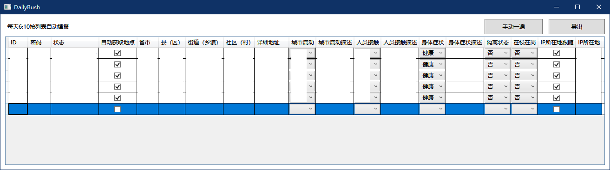

# RushInput

> 辽宁大学疫情通自动填报工具

## 使用方法

在列表中双击新增条目

单击“手动一遍”按钮可以手动对列表中所有条目进行填报。

单击“导出”按钮可以将列表中内容导出到"userlist.xml"文件中，若程序启动时同一目录下有"userlist.xml"文件，程序将自动识别导出配置内容，并填充列表框。

**Requirements:**
dotnet Framework 4.6.1

## 敬告

请勿用于违法违规用途，仅供技术交流。

